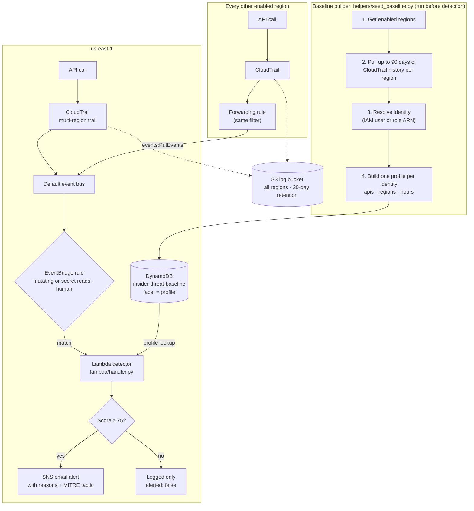
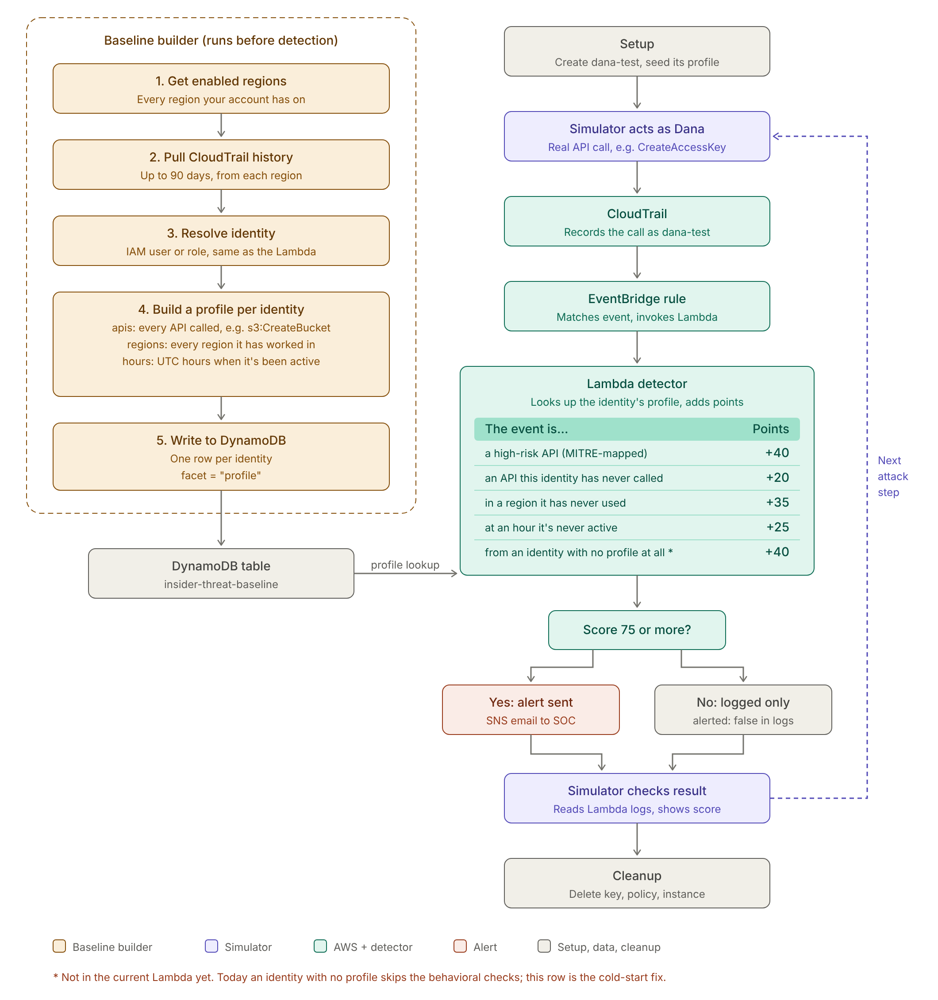

# AWS IAM Insider Threat Detection

A group project for Cloud Computing. It watches every AWS API call in the
account and alerts when an identity does something **unusual for that specific
identity**, not just something on a known-bad list.

A stolen access key and a malicious insider look identical in the logs: both
are a valid identity making valid calls. What gives them away is behaving
differently from that identity's own history. So we baseline each user and
role, score every risky call against its baseline, and email an explained alert
when the score crosses a threshold.

---

## Project phases

| Phase | What | Status |
|---|---|---|
| 1. Foundation | Terraform state backend; multi-region CloudTrail trail and log bucket | Done |
| 2. Detection pipeline | EventBridge rule, cross-region forwarding to us-east-1, Lambda, SNS email alerts | Done |
| 3. Behavioral detection | Per-identity baselines (`seed_baseline.py`); scoring on new API, region, hour and IP; MITRE ATT&CK mapping; secret reads and exfiltration APIs | Code done; deploy and re-seed pending |
| 4. Decoy data | A "crown jewels" decoy bucket with CloudTrail data events, so stolen files show up as `s3:GetObject` | Not started |
| 5. Attack simulation | A `dana-test` script that replays a stolen-credential attack step by step and shows each score ([see below](#demo-flow-phase-5)) | Not started |
| 6. Alert dashboard | A cleaner view of alerts than raw emails: scores, identities, regions, tactics and reasons in one place | Not started |

Each phase builds on the one before. Phase 3's Lambda already scores
`s3:GetObject`, so Phase 4 needs no Lambda changes. Phase 5 reads the Lambda's
JSON log lines (`score`, `alerted`, `reasons`), and Phase 6 can display the same
fields.

---

## How it works



1. **CloudTrail** records every management API call. The trail is set to
   `is_multi_region_trail = true`, so every region is logged into one S3 bucket.
2. **EventBridge** filters for calls worth scoring:
   - mutating calls (`readOnly = false`), plus a short list of sensitive reads
     (secrets, and S3 object reads where data events are enabled);
   - made by an IAM user, assumed role or the root user, not by an AWS service
     acting on its own (no `invokedBy`);
   - not from CloudWatch Logs, which would make the Lambda trigger itself.
3. **The Lambda** looks up the identity's profile in DynamoDB, adds up a risk
   score, and decides whether to alert.
4. **SNS** emails the alert, explaining in plain language why it fired.

### Multi-region: one Lambda for every region

CloudTrail delivers each event to EventBridge **in the region where the call
happened**, and an EventBridge rule can't invoke a Lambda in another region.
It *can* send events to another region's event bus. So each enabled region
outside us-east-1 gets a small forwarding rule, using the same filter, that sends
matches to the us-east-1 default bus:

```
eu-west-1:  CloudTrail event → forwarding rule ─┐
us-west-2:  CloudTrail event → forwarding rule ─┼→ us-east-1 default bus → existing rule → the one Lambda → SNS
us-east-1:  CloudTrail event ───────────────────┘
```

- There is one detector, one scoring path and one SNS topic.
- us-east-1 has no forwarding rule, so forwarded events can't loop.
- Enabled regions are discovered automatically ([main/forwarding.tf](main/forwarding.tf)).
- IAM is a global service, so IAM changes arrive in us-east-1 no matter where the caller is.

---

## What the baseline does

The baseline is a **record of each identity's normal behaviour**. Every new
event is compared against it, so the detector can tell "normal for them" from
"out of character". `helpers/seed_baseline.py` builds it from the last 90 days
of CloudTrail history, and the Lambda reads it for every event.

**Example.** The baseline for `admin.me`:

| What | Normal for admin.me |
|---|---|
| APIs | `s3:CreateBucket`, `dynamodb:CreateTable`, `lambda:UpdateFunctionCode` … |
| Regions | `us-east-1` |
| Hours (UTC) | 13–23 (daytime, US Central) |
| IPs | `198.51.100.7` (home) |

Two events arrive, both using admin.me's valid key:

| | admin.me, normally | Someone with a stolen key |
|---|---|---|
| Action | `s3:CreateBucket` | `ssm:GetParameter` (reading a secret) |
| Region | us-east-1 ✓ | eu-west-1 ✗ new region, +35 |
| Time | 3pm ✓ | 4am ✗ unusual hour, +25 |
| IP | home ✓ | unknown ✗ new IP, +25 |
| API | used before ✓ | never used ✗ new API +20, high-risk +40 |
| **Score** | **0: nothing happens** | **145: alert email** |

**Why this matters:** both events come from a real, valid identity, so a list of
"bad API calls" can't tell them apart. The baseline can, because it knows what
*this particular person* normally does. That's how the project catches stolen
credentials and insiders.

### First seed run (October 1, 2026)

What `seed_baseline.py` recorded from our account's CloudTrail history:

| Identity | Regions | Hours (UTC) | IPs | APIs |
|---|---|---|---|---|
| `user/admin.me` | 17 (every region) | 0, 1, 18, 19, 20, 23 | 10 (4 are IPv6) | 236 |
| `user/shadab.dev` | us-east-1, us-east-2 | 22 only | 3 | 17 |
| `user/rency.dev` | us-east-1, us-east-2 | 19 only | 1 | 15 |
| `role/insider-threat-detector` | us-east-1 | 1, 19, 20 | 17 (AWS Lambda IPs) | 2 |
| 5 AWS service and demo roles | various | various | various | mostly read-only lists |

`yael.dev` has no baseline yet (no recorded activity in the last 90 days).

Issues this run revealed:
- **admin.me's region list is polluted.** The script learned from read-only
  calls too, including its own `LookupEvents` in every region, so every region
  looks normal and the new-region signal can't fire for that user. *Fixed:* the
  script now learns only from events the detector scores (mutating calls plus
  secret reads, no AWS-service or CloudWatch Logs calls), and removes profiles
  left over from earlier runs.
- **IPv6 addresses rotate.** A home network gets new IPv6 addresses over time,
  which would trip the new-IP signal on normal activity. *Fixed:* IPv6 is now
  compared by network (`/64`) instead of exact address; IPv4 stays exact.
- **Lambda API names carry a version suffix** (`CreateFunction20150331`), so
  `lambda:CreateFunction` on the high-risk list never matched. *Fixed:* the
  handler and seed script now strip these suffixes.
- **Teammate profiles are thin.** One active hour each, so the hour signal will
  fire often until they have more history.

Without a baseline, every identity counts as unknown. The behavioural checks
(new API, region, hour and IP) can't run, so only the fixed high-risk rules
apply. Run the seed script after deploying, and re-run it now and then so new
normal activity is learned (see [Setup](#4-build-the-baselines)).

---

## Scoring

Every event that reaches the Lambda gets a score. **75 or more sends an alert.**

| The event is… | Points |
|---|---|
| A high-risk API (see below) | +40 |
| Logging tampering (`StopLogging`, `DeleteTrail`, `UpdateTrail`, `PutEventSelectors`) | +75 (alerts on its own) |
| An API this identity has never called | +20 |
| In a region this identity has never used | +35 |
| At a UTC hour this identity is never active | +25 |
| From an IP address this identity has never used | +25 |
| From an identity with no profile at all | +40 |
| Any activity by the root user | raised to at least 75 |
| Security group ingress opened to `0.0.0.0/0` or `::/0` | +35 (on top of the high-risk API; alerts on its own) |


**High-risk APIs, by MITRE ATT&CK tactic:**

| Tactic | APIs |
|---|---|
| Privilege Escalation | `iam:AttachUserPolicy`, `PutUserPolicy`, `AttachRolePolicy`, `PutRolePolicy`, `CreatePolicyVersion`, `SetDefaultPolicyVersion`, `AddUserToGroup`, `UpdateAssumeRolePolicy` |
| Persistence | `iam:CreateAccessKey`, `CreateLoginProfile`, `UpdateLoginProfile`, `CreateUser`, `lambda:CreateFunction` |
| Defense Evasion | `iam:DeactivateMFADevice`, `ec2:AuthorizeSecurityGroupIngress` (extra +35 if the rule is `0.0.0.0/0` or `::/0`). Logging tampering is listed above and scores +75. |
| Credential Access | `ssm:GetParameter`, `ssm:GetParameters`, `secretsmanager:GetSecretValue` |
| Exfiltration | `s3:PutBucketPolicy`, `PutBucketAcl`, `PutBucketReplication`, `DeleteBucketPublicAccessBlock`, `ec2:ModifySnapshotAttribute`, `ModifyImageAttribute`, `rds:ModifyDBSnapshotAttribute` |
| Collection | `s3:GetObject` (only for buckets with CloudTrail data events enabled) |
| Resource Hijacking | `ec2:RunInstances` |

Most reads are filtered out before reaching the Lambda. The exceptions are
reading secrets (`GetParameter`, `GetParameters`, `GetSecretValue`) and
`GetObject`, which the EventBridge rule lets through using an `$or` filter.

- **Unknown identities.** A brand-new user (for example, a backdoor account an
  attacker created) has no history to compare against. It still scores 40, so
  any high-risk call it makes alerts.
- **Failure mode.** If the DynamoDB lookup fails, the event alerts rather than
  being silently dropped (it *fails closed*).
- **MITRE ATT&CK.** Each high-risk API is mapped to a tactic (Persistence,
  Privilege Escalation, Defense Evasion, Resource Hijacking, Execution), which
  appears in the alert email.

### Tested scenarios

The handler was run against mocked AWS clients in 15 scenarios, and all passed:

| Scenario | Alerts? |
|---|---|
| Known user, normal activity | No |
| Known user, `StopLogging` | Yes |
| Known user, new API at an unusual hour | No |
| Known user, high-risk API plus anomalies | Yes |
| Unknown user, normal call | No |
| Unknown user, `CreateAccessKey` | Yes |
| DynamoDB error | Yes |
| Known user, new IP only (25) | No |
| Known user, new IP + new region (60) | No |
| Source IP is a hostname, not an IP | No (no IP signal) |
| Known user, `GetParameter` + new IP + new API (85) | Yes |
| Known user, `PutBucketPolicy` + new region + new IP + new API (120) | Yes |
| Root user, `CreateAccessKey` (80) | Yes |
| Root user, routine call that matches its profile (75) | Yes |
| Unknown user, `iam:CreateUser` (80) | Yes |

---

## Demo flow (Phase 5)

The live demo uses a test identity, `dana-test`, to walk through an attack one
step at a time and show how each step scores. This is Phase 5; the simulator
script isn't in the repo yet.



> The footnote in this diagram is out of date: the "identity with no profile"
> check (+40) is already in the Lambda.

---

## Repository layout

| Path | What it is |
|---|---|
| [bootstrap/main.tf](bootstrap/main.tf) | S3 bucket for shared Terraform state. Run once. |
| [main/main.tf](main/main.tf) | Multi-region CloudTrail trail and its S3 log bucket |
| [main/eventbridge.tf](main/eventbridge.tf) | Filter rule, Lambda, and the Lambda's IAM role |
| [main/forwarding.tf](main/forwarding.tf) | Per-region forwarding rules to us-east-1 |
| [main/dynamodb.tf](main/dynamodb.tf) | Baseline table (`identity` + `facet`) |
| [main/sns.tf](main/sns.tf) | Alert topic and email subscription |
| [lambda/handler.py](lambda/handler.py) | Scoring and alerting logic |
| [helpers/seed_baseline.py](helpers/seed_baseline.py) | Builds baselines from CloudTrail history |
| [Updates/](Updates/) | Build log, detection guide, team notes |

---

## Setup

Each teammate needs their **own IAM user and access key**. Sharing credentials
merges everyone's behaviour into one baseline, which defeats the project.

### 1. Install the tools (Windows PowerShell, not as Administrator)

```powershell
winget install HashiCorp.Terraform
winget install Amazon.AWSCLI
pip install boto3
```

Reopen PowerShell so PATH refreshes, then check with `terraform -version` and
`aws --version`.

### 2. Configure credentials

```powershell
aws configure                 # key id, secret, us-east-1, json
aws sts get-caller-identity   # ARN must end in :user/your-name, never :root
```

### 3. Deploy

The state bucket only needs creating once per account:

```powershell
cd bootstrap
terraform init
terraform apply
```

Then the detection pipeline:

```powershell
cd ../main
terraform init
terraform apply -var="alert_email=you@example.com"
```

AWS sends a confirmation email to that address. **Click the link**, or no
alerts are delivered.

### 4. Build the baselines

```powershell
python helpers/seed_baseline.py
aws dynamodb scan --table-name insider-threat-baseline --query "Count"
```

Until this runs, every identity counts as unknown. Profiles built before the
source-IP signal was added have no IPs, so re-run it to turn that signal on. The script takes several
minutes because CloudTrail history lookups are rate-limited. Re-run it now and
then so new normal activity is learned; the Lambda never updates baselines
itself.

---

## Testing

Trigger an event in another region (this also tests forwarding) and watch the
Lambda:

```powershell
aws s3api create-bucket --bucket test-detect-euw1-<account-id> --region eu-west-1 --create-bucket-configuration LocationConstraint=eu-west-1
aws s3api delete-bucket --bucket test-detect-euw1-<account-id> --region eu-west-1
aws logs tail /aws/lambda/insider-threat-detector --since 2m --filter-pattern "identity" --region us-east-1
```

Each log line shows the identity, API, score, and whether it alerted. Allow
10–20 seconds for events to arrive. See
[Updates/detectionguide.md](Updates/detectionguide.md) for how to change what
gets detected.

---

## Cost

The project is designed to run at **$0**:

- Management events only. Never enable CloudTrail data events or Insights.
- One trail. A second trail in the same region is billed.
- `AES256` encryption everywhere, never `aws:kms` ($1/month per key).
- DynamoDB at 1 read / 1 write capacity unit, inside the free tier.
- 7-day log retention on the Lambda's log group.
- Forwarded cross-region events cost about $1 per million, so effectively free.
- No VPC for the Lambda (that would need a NAT gateway, about $33/month).

**On `terraform destroy`:** it deletes the baseline table and its data, all
CloudTrail logs, and the SNS subscription. After rebuilding, you have to re-run
the seed script and re-confirm the email. Since the stack costs nothing while
idle, leaving it running is usually simpler.

---

## Known limitations

- **Shared roles share a baseline.** Assumed-role sessions resolve to the role
  ARN, so people sharing a role share one profile.
- **Baselines are static.** They're a snapshot from the last seed run.
- **The seed script learns from whatever happened.** Activity in the last 90
  days, including test activity, counts as normal.

---

## Git workflow

```bash
git branch                          # which branch am I on?
git checkout your-branch-name       # switch to your branch
git pull origin your-branch-name    # get the latest version of it

# Save and push your work
git add .
git commit -m "Clear description"
git push origin your-branch-name

# Bring another branch's work into yours
git pull origin other-branch-name

# See branches
git branch -a                       # local + remote
git log origin/ryan-dev --oneline -10
```
